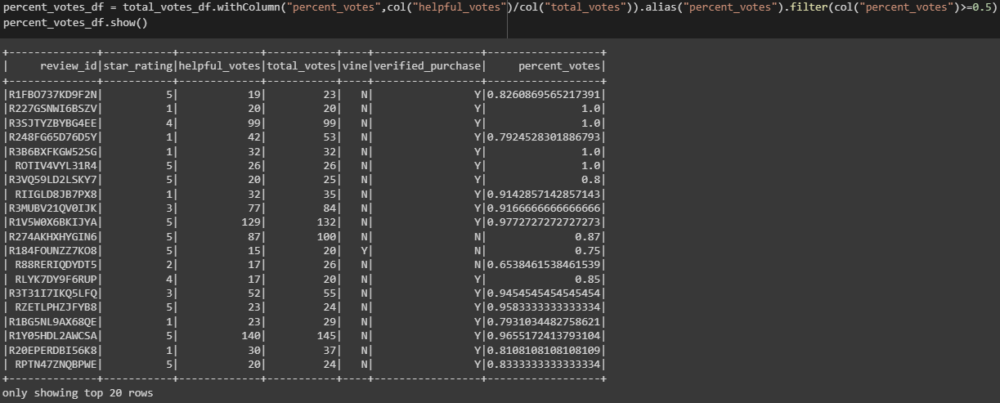

# Amazon-Vine-Analysis
Big Data Analysis using Google Colab, PySpark, PostgreSQL/pgAdmin, AWS RDS, Pandas and SQL.

## Overview:
The objective of this project was to analyze Amazon reviews written by members of `Paid Amazon Vine Program`, a service that allows the manufacturers and publishers to receive reviews of their products and determine if there is any bias between `vine` members and `non-vine` members

Companies which are willing to pay a fee to Amazon and may provide free products to Vine members who are then required to publish a review. In order to determine if there was any bias in amassing favourable reviews from vine members vs non-vine members, we needed to identify the percentage of 5-Star Ratings to the total ratings published by all the members and non-members. For this exercise we were allowed to choose from 50+ datasets to extract, transform and load the datasets into dataframes to accomplish this task and perform the analysis.

Throughout the exercise we used the following:
* `PySpark` to extract the dataset, transform the data and connect to `AWS RDS` instance and load the transformed data into `pgAdmin`.
* `Google Colab` was used to import the `PySpark` libraries and connect to `Postgres` in order to create `SQL` tables and export the results.

For the purpose of this analysis we used the `Electronics` Dataset found [here](https://s3.amazonaws.com/amazon-reviews-pds/tsv/index.txt).

## Results:
The Dataset had 3+ million reviews recorded. In order to focus on the reviews we had to determine which one of them were more likely to be helpful and hence we filtered the dataset by the:
* Count of Total Votes equal or greater than 20.
* Percent of Helpful Votes to Total Votes equal or greater than 50%.

The results reduced our review counts from 3+ million to ~51,000. This allowed us to answer the following questions:

1. How many vine reviews and non-vine reviews were there?
Vine members made up 2.1% (1,080) of the reviews where as the remaining 97.9% were non-vine members (49,659).

2. How many vine reviews were 5 stars? How many non-vine reviews were 5 stars?
* Vine members gave 454 out of 1,080 reviews for 5 star ratings.
* Non-vine members gave 23,034 out of 49,659 reviews for 5 star ratings.

3. What percentage of vine reviews were 5 stars? What percentage of non-vine reviews were 5 stars?
* 42% of the reviews for vine members were 5 Stars.
* 46.4% of the reviews for non-vine members were 5 stars.

## Summary:
Based on the results, Vine members did not show any bias when rating their products considering the number of 5-star ratings was about 5% less than non-vine members (42% vs 46.4%). With this we can conclude that the vine customers are more critical when submitting their reviews. To further this claim we should include all the reviews instead of the helpful reviews to get a better understanding. 

In addition, running the same analysis on other datasets from different product categories could provide us with more insight regarding the bias of vine/non-vine reviews.
